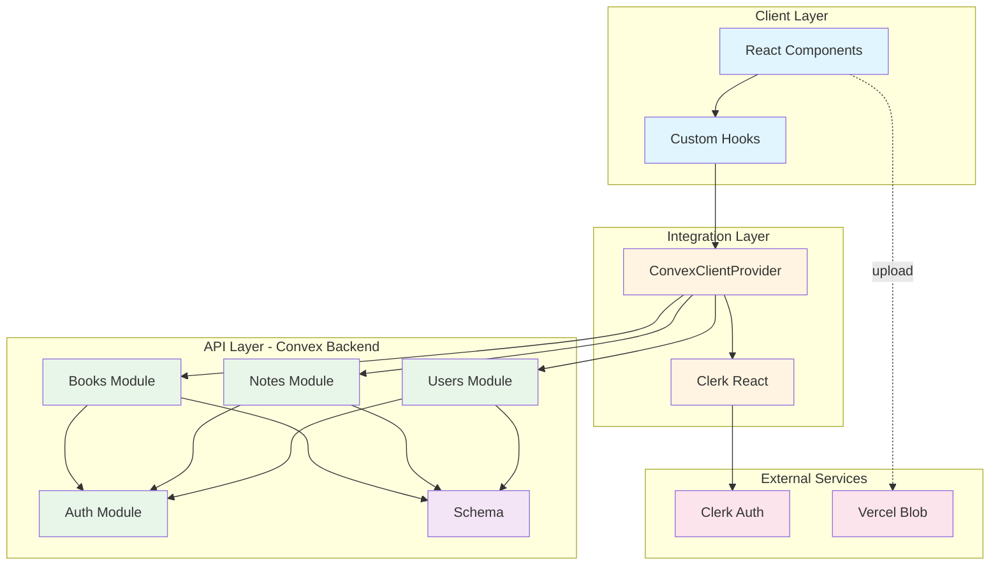
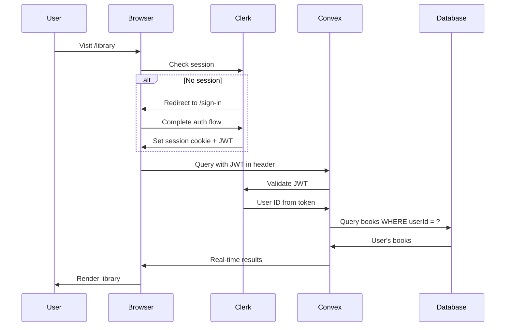
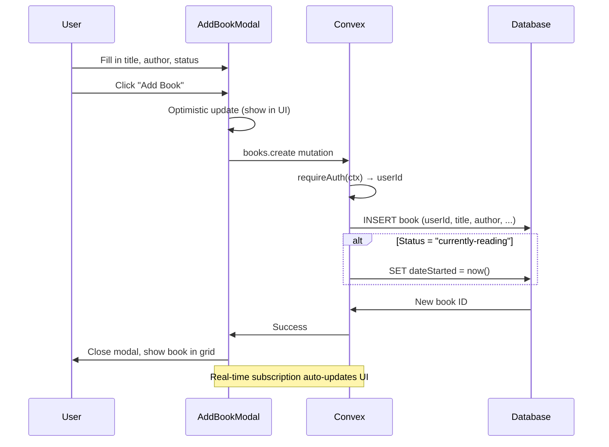
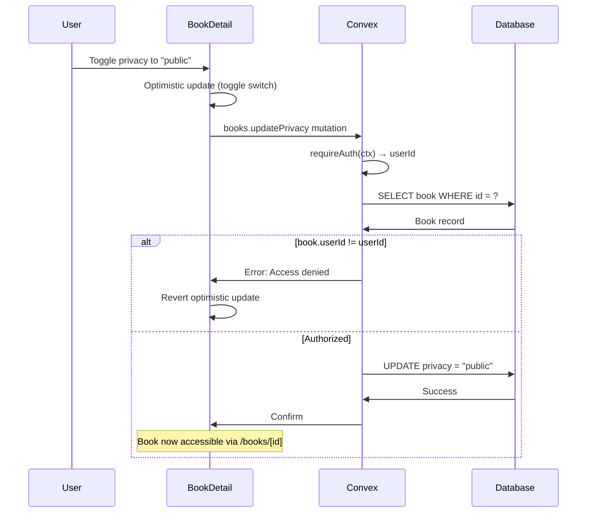
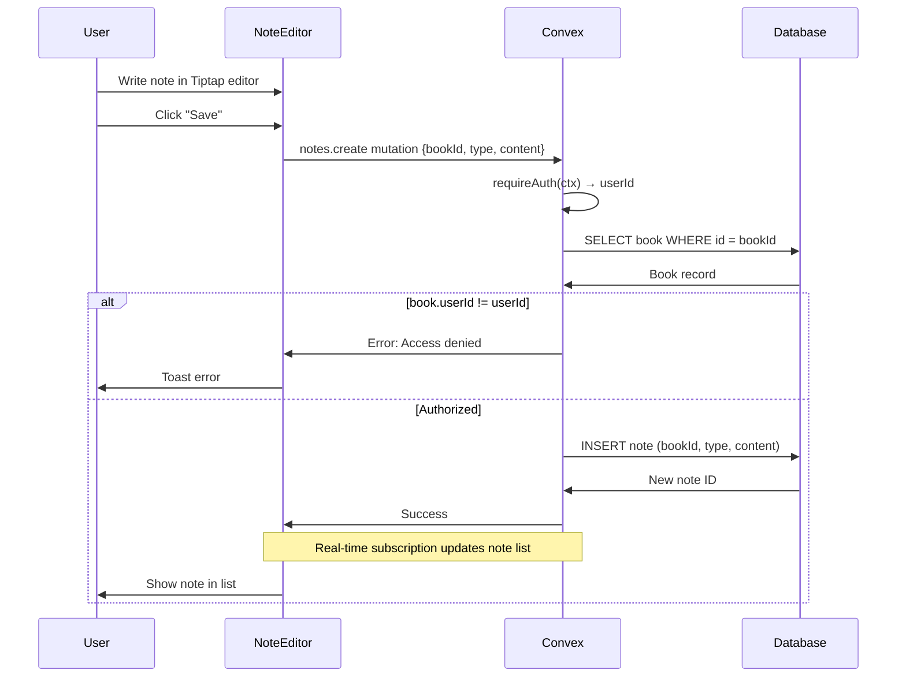
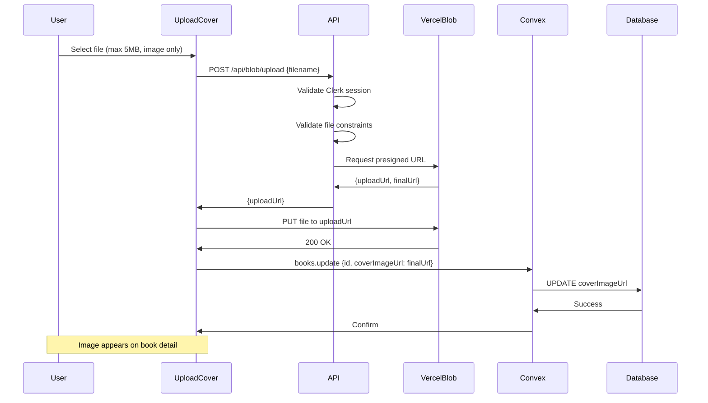
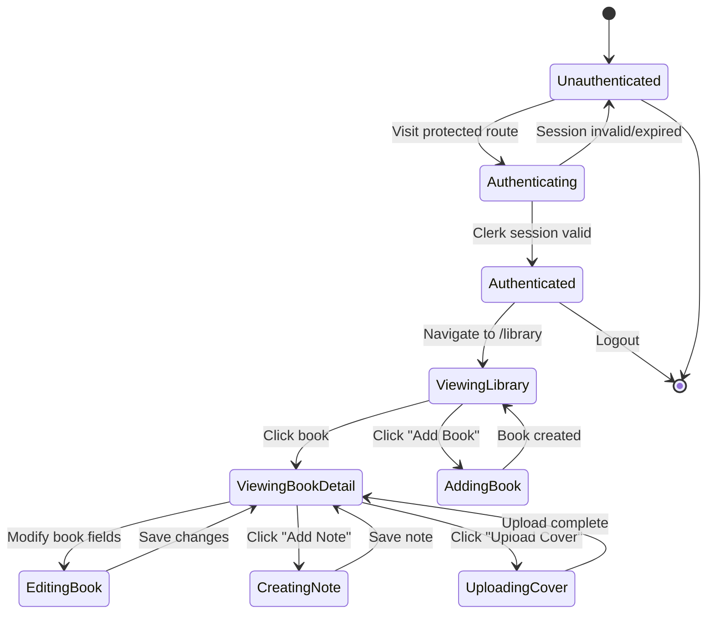
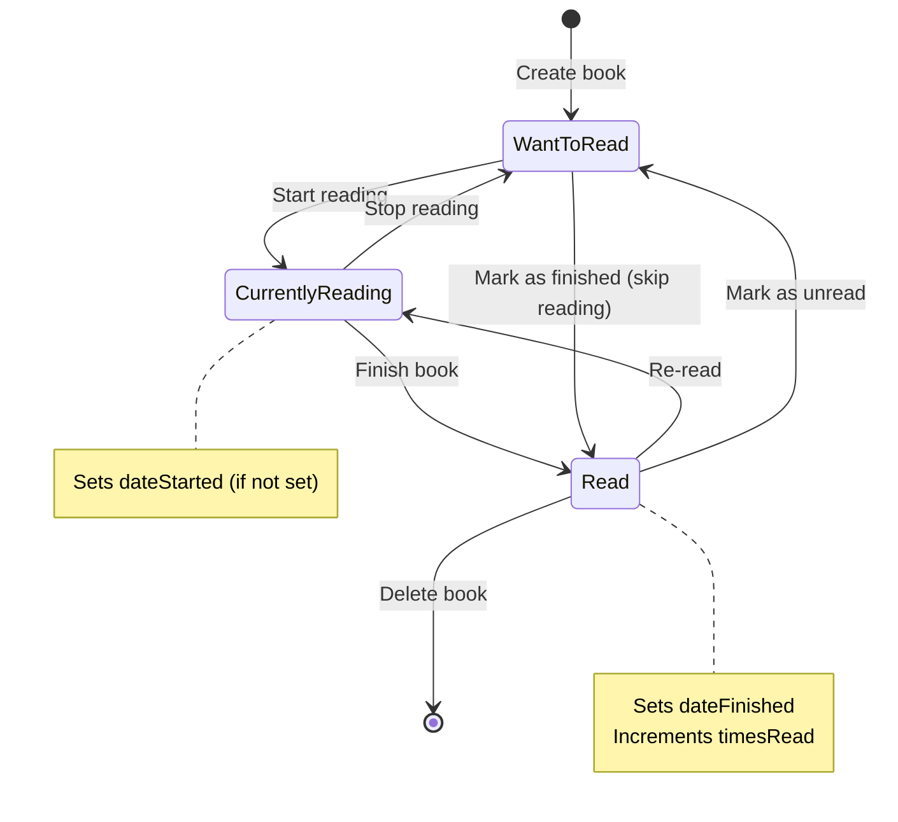
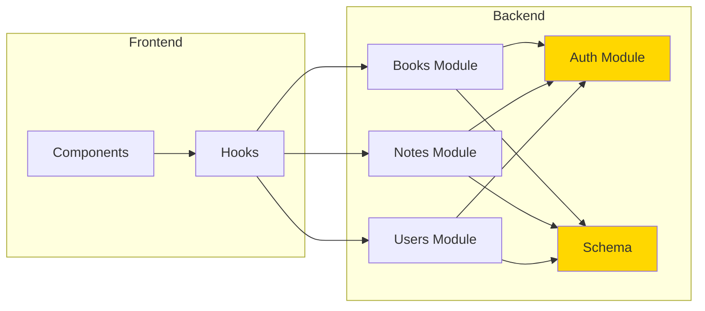

# Architecture

## Overview

bibliomnomnom is a privacy-first book tracking application built with Next.js 16, React 19, and Convex. The architecture follows a "Convex-First with Actions" pattern where Convex is the single source of truth, providing real-time updates, type safety, and clean module boundaries.

**Core Philosophy**: Deep modules with simple interfaces that hide complexity behind clear contracts. Authentication, privacy filtering, auto-dating, and file uploads are abstracted into focused modules that can be understood and modified independently.

## Design Principles

### 1. **Convex as Single Source of Truth**

All data operations flow through Convex for consistency and real-time updates. No client-side state management beyond local UI concerns. Convex provides reactivity automatically—components re-render when data changes.

### 2. **Queries for Reads, Mutations for Writes, Actions for External**

- **Queries**: Pure functions that read database state (cacheable, reactive)
- **Mutations**: Transactional writes to the database (atomic, consistent)
- **Actions**: External API calls or file operations (non-transactional)

### 3. **Row-Level Security in Queries**

Privacy enforced at the query level via ownership checks. Every book/note query filters by `userId`. Users can only access their own data or explicitly public books.

### 4. **Optimistic Updates**

UI updates instantly before server confirmation. Convex automatically rolls back on error. Users see immediate feedback without waiting for round-trip latency.

### 5. **Deep Modules**

Simple interfaces hiding complex implementation. Examples:

- **Auth module**: 2 functions (`requireAuth`, `getAuthOrNull`) hide Clerk JWT validation
- **Books module**: 8 operations hide auto-dating, privacy filtering, ownership validation
- **File upload**: 1 endpoint hides Vercel Blob complexity via presigned URLs

## System Diagram



## Modules

### Module 1: Authentication & User Management

**Purpose**: Abstracts Clerk JWT validation and user lifecycle management.

**Responsibilities**:

- Validate Clerk JWT tokens and extract user ID
- Sync Clerk user events (create, update, delete) to Convex
- Provide auth helpers for all mutations/queries

**Interface**:

```typescript
// convex/auth.ts
export async function requireAuth(ctx: QueryCtx | MutationCtx): Promise<string>
export async function getAuthOrNull(ctx: QueryCtx | MutationCtx): Promise<string | null>

// convex/users.ts
export const getCurrentUser = query(...)
export const createOrUpdateUser = internalMutation(...)
export const deleteUser = internalMutation(...)
```

**Dependencies**:

- Requires: Clerk (external)
- Used by: Books, Notes, Users modules

**Files**:

- `convex/auth.ts` - Auth helpers (41 lines)
- `convex/users.ts` - User queries/mutations (61 lines)
- `app/api/webhooks/clerk/route.ts` - Webhook handler (116 lines)

---

### Module 2: Books Data Layer

**Purpose**: Manages book CRUD operations, privacy filtering, status tracking, and auto-dating.

**Responsibilities**:

- List/get books with ownership validation
- Create/update/delete books
- Manage reading status with auto-dating (dateStarted, dateFinished)
- Toggle favorite/privacy/audiobook flags
- Sanitize public book data

**Interface**:

```typescript
// convex/books.ts
export const list = query(...)           // Filter by userId, optional status
export const get = query(...)            // Private book (owner only)
export const getPublic = query(...)      // Public book (sanitized)
export const create = mutation(...)      // Add book
export const update = mutation(...)      // Update book fields
export const remove = mutation(...)      // Delete book
export const updateStatus = mutation(...) // Change status (triggers auto-dating)
export const toggleFavorite = mutation(...)
export const updatePrivacy = mutation(...)
```

**Auto-Dating Logic**:

- Status → **"currently-reading"**: Sets `dateStarted` if not already set
- Status → **"read"**: Sets `dateFinished`, increments `timesRead`
- Status → **"want-to-read"**: No date changes

**Privacy Model**:

- **Private books**: Only owner can access via `get()` query
- **Public books**: Anyone can access via `getPublic()` query (returns `PublicBook` type with sanitized fields)

**Dependencies**:

- Requires: Auth module
- Used by: Notes module (note ownership derived from book ownership)

**Files**:

- `convex/books.ts` - Core implementation (298 lines)
- `components/book/*.tsx` - UI components (521 lines total across 7 files)

---

### Module 3: Notes & Content

**Purpose**: Manages notes, quotes, and reflections with book ownership validation.

**Responsibilities**:

- List notes for a book
- Create/update/delete notes
- Validate ownership indirectly via book relationship
- Support markdown content with Tiptap rich text editor

**Interface**:

```typescript
// convex/notes.ts
export const list = query(...)      // Get notes for a book
export const create = mutation(...) // Add note (validates book ownership)
export const update = mutation(...) // Update note
export const remove = mutation(...) // Delete note
```

**Note Types**:

- `note` - General observations or thoughts
- `quote` - Direct quotes from the book
- `reflection` - Personal insights or analysis

**Ownership Model**:

- Notes validate ownership via book relationship (not direct userId check)
- Query fetches book, checks book ownership, then returns notes
- Avoids redundant userId storage on notes table

**Dependencies**:

- Requires: Auth module, Books module (for ownership validation)
- Used by: BookDetail component

**Files**:

- `convex/notes.ts` - Core implementation (95 lines)
- `components/notes/*.tsx` - UI components (5 files)

---

### Module 4: External Book Search (Deferred for MVP)

**Purpose**: Search Google Books API for book metadata and auto-populate fields.

**Status**: Architecture designed but implementation deferred post-MVP.

**Rationale**: Manual entry is sufficient for MVP. API integration adds complexity (rate limits, error handling, data mapping) without being blocking for core reading tracking workflow.

**Future Implementation**:

- Convex action to call Google Books API
- Search by title, author, ISBN
- Auto-populate title, author, pageCount, genres from API response
- User reviews metadata before saving

---

### Module 5: File Upload

**Purpose**: Generate presigned URLs for Vercel Blob cover uploads.

**Responsibilities**:

- Validate authentication and file constraints (type, size)
- Generate presigned upload URLs
- Client uploads directly to blob storage (not through Next.js server)

**Interface**:

```typescript
// app/api/blob/upload/route.ts
POST / api / blob / upload;
Body: {
  filename: string;
}
Returns: {
  uploadUrl: string;
}
```

**Upload Flow**:

1. Client calls `/api/blob/upload` with filename
2. Server validates auth (Clerk) and file constraints
3. Server generates presigned URL from Vercel Blob
4. Client uploads file directly to blob storage via presigned URL
5. Blob returns final URL, client saves to book record via `updateBookCover` mutation

**Security**:

- 5MB max file size
- Image types only (JPEG, PNG, WebP)
- Auth required (Clerk session)
- Presigned URLs expire after use

**Dependencies**:

- Requires: Clerk (auth), Vercel Blob SDK
- Used by: UploadCover component

**Files**:

- `app/api/blob/upload/route.ts` - API route (50 lines)
- `components/book/UploadCover.tsx` - Upload UI

---

## Data Flow

### Authentication Flow



### Book Creation Flow



### Privacy Decision Flow



### Note Creation with Ownership Validation



### File Upload Flow



## State Management

### Application State



### Book Status State Machine



## Module Boundaries

### Depth Analysis (Ousterhout Lens)

| Module                          | Interface   | Implementation                          | Depth              | Score   |
| ------------------------------- | ----------- | --------------------------------------- | ------------------ | ------- |
| **convex/auth.ts**              | 2 functions | HIGH (JWT validation, DB lookup)        | **DEEP**           | 9/10 ✅ |
| **convex/books.ts**             | 8 functions | HIGH (auto-dating, privacy, validation) | **DEEP**           | 9/10 ✅ |
| **convex/notes.ts**             | 4 functions | MEDIUM (CRUD + indirect ownership)      | **MEDIUM-DEEP**    | 8/10 ✅ |
| **convex/users.ts**             | 3 functions | LOW (straightforward CRUD)              | **SHALLOW-MEDIUM** | 7/10 ✅ |
| **lib/hooks/useAuth.ts**        | 1 hook      | MEDIUM (auth timing coordination)       | **DEEP**           | 9/10 ✅ |
| **lib/hooks/useAuthedQuery.ts** | 1 hook      | HIGH (defers queries, prevents errors)  | **DEEP**           | 9/10 ✅ |
| **app/api/blob/upload**         | 1 endpoint  | MEDIUM (token gen, validation)          | **DEEP**           | 8/10 ✅ |
| **app/api/webhooks/clerk**      | 1 endpoint  | MEDIUM (sig validation, routing)        | **MEDIUM-DEEP**    | 8/10 ✅ |

**Average Depth**: 8.4/10 - Excellent module design discipline

### Dependency Graph



**Key Insights**:

- ✅ **No circular dependencies** - Clean unidirectional flow
- ✅ **Auth module is dependency-free** - Pure authentication logic
- ✅ **Schema is foundational** - All modules depend on it, as expected
- ✅ **Frontend never imports backend** - Only uses generated API types

### Information Hiding Assessment

**Excellent**:

- ✅ Auth module exposes only `requireAuth()` and `getAuthOrNull()` - Clerk implementation hidden
- ✅ Privacy abstraction: `getPublic()` returns sanitized `PublicBook` type - Private fields never leak
- ✅ File upload: Client uploads directly to blob - Server only generates tokens

**Good**:

- ✅ Notes ownership validated via book relationship - No redundant userId on notes
- ✅ Auto-dating logic internal to `updateStatus` - Client doesn't manage dates

**Minor Concern** (acceptable):

- ⚠️ BookDetail component imports NoteList (cross-domain coupling) - Mitigated by compositional embedding

## Key Architectural Decisions

### Decision 1: Convex as Backend

**Date**: 2025-01-10

**Context**: Need a backend database and API layer. Options: traditional REST API + PostgreSQL, Firebase, Supabase, or Convex.

**Options Considered**:

1. **Next.js API Routes + PostgreSQL** (traditional)
   - Pros: Full control, well-known patterns
   - Cons: No real-time updates, manual cache invalidation, API layer boilerplate

2. **Firebase** (Google's BaaS)
   - Pros: Real-time, good free tier, mature
   - Cons: Vendor lock-in, NoSQL limitations, complex security rules

3. **Convex** (real-time backend)
   - Pros: Real-time by default, type-safe, simple security model, excellent DX
   - Cons: Newer (less mature), vendor-specific, learning curve

**Chosen**: Convex

**Rationale**:

- **Type safety**: End-to-end TypeScript from schema → queries → components
- **Real-time**: Automatic reactivity without manual subscriptions or polling
- **Simple security**: Row-level security via ownership filtering in queries
- **Developer experience**: Single source of truth, no API layer boilerplate

**Consequences**:

**Positive**:

- Real-time updates feel magical (book added → instantly appears in UI)
- Type safety catches bugs at compile time
- No need for React Query, SWR, or other cache layers

**Negative**:

- Vendor lock-in (migration would require rewriting entire backend)
- Smaller ecosystem than Firebase/Supabase
- Team must learn Convex patterns

**Accepted Trade-offs**:

- Vendor lock-in acceptable for MVP (prioritize speed over portability)
- Learning curve acceptable (excellent docs, strong TypeScript support)

---

### Decision 2: Privacy Model (Private by Default)

**Date**: 2025-01-15

**Context**: Users need to control visibility of their reading data.

**Options Considered**:

1. **Public by default** (like Goodreads)
   - Pros: Encourages social features, easier to build discovery
   - Cons: Privacy concerns, users may not add sensitive books

2. **Private by default** (privacy-first)
   - Pros: User trust, no accidental exposure, aligns with "digital garden" philosophy
   - Cons: Harder to build social features, requires explicit public sharing

3. **Workspace model** (public + private collections)
   - Pros: Flexible, users can separate personal/public
   - Cons: Complex, adds cognitive load

**Chosen**: Private by default with explicit public opt-in

**Rationale**:

- **Privacy-first philosophy**: "Your data stays yours" is a core value proposition
- **Trust**: Users more likely to add personal/sensitive books if private by default
- **Selective sharing**: Users opt-in to public sharing per book (not all-or-nothing)

**Implementation**:

- Books created with `privacy: "private"` by default
- `books.get()` query enforces owner-only access
- `books.getPublic()` query returns sanitized `PublicBook` type
- Public route `/books/[id]` uses `getPublic()` query

**Consequences**:

**Positive**:

- Users trust the platform with personal reading data
- Aligns with "digital garden" metaphor (curated, intentional)
- Enables future "share reading list" feature

**Negative**:

- Social features harder to build (no global book discovery)
- Users must manually toggle public for each book

**Accepted Trade-offs**:

- Social features deferred post-MVP (prioritize privacy over virality)
- Manual toggle acceptable (encourages intentional sharing)

---

### Decision 3: Manual Book Entry (Defer API Integration)

**Date**: 2025-01-20

**Context**: Users need to add books to their library.

**Options Considered**:

1. **Manual entry only** (MVP)
   - Pros: Simple, no external dependencies, no rate limits
   - Cons: More user friction, no ISBN lookup, manual typing

2. **Google Books API integration** (full feature)
   - Pros: Auto-populate metadata, search by ISBN, less typing
   - Cons: API rate limits, error handling complexity, data mapping

3. **Hybrid** (manual + API fallback)
   - Pros: Best of both worlds
   - Cons: Most complex, adds testing burden

**Chosen**: Manual entry only (MVP), defer API to post-MVP

**Rationale**:

- **Speed to MVP**: Manual entry is 2-3 days vs. 1-2 weeks for API integration
- **Core workflow**: Users can track books without API (only convenience feature)
- **Complexity avoidance**: Rate limits, error handling, data mapping add significant complexity
- **Validatable**: Can validate core reading tracking workflow before adding convenience

**Implementation**:

- AddBookModal with form fields (title, author, pageCount, genres)
- No search/lookup functionality
- User types all metadata manually

**Consequences**:

**Positive**:

- MVP ships faster (weeks earlier)
- No external API dependencies or rate limit concerns
- Simpler error handling (no network failures)

**Negative**:

- More friction for users (manual typing)
- No ISBN barcode scanning
- Typos in author/title

**Accepted Trade-offs**:

- User friction acceptable for MVP (validates core value before polish)
- API integration planned for v1.1 (post-MVP backlog)

---

## Performance & Scalability

### Query Optimization

All queries use database indexes for performance:

**Books Queries**:

- `by_user` - Index on `userId` for ownership filtering
- `by_user_status` - Composite index on `userId` + `status` for filtered lists
- `by_user_favorite` - Index on `userId` + `favorite` for favorites view

**Notes Queries**:

- `by_book` - Index on `bookId` for fetching book notes
- `by_user` - Index on `userId` for user's notes across all books

**Performance Targets**:

- Query response: < 100ms (Convex real-time updates)
- Mutation response: < 200ms (database writes)
- File upload: < 3 seconds for 5MB (direct-to-blob upload)

### Scalability Considerations

**Current Scale**: MVP designed for 100-1,000 users

- Convex free tier: Unlimited dev deployments, generous prod limits
- Clerk free tier: 10,000 monthly active users
- Vercel Blob free tier: 100 GB bandwidth/month

**Scaling Strategy**:

- **Database**: Convex auto-scales (serverless)
- **Frontend**: Vercel Edge Network (global CDN)
- **File storage**: Vercel Blob (auto-scales)
- **Bottleneck**: None anticipated for <10K users

**Future Optimizations** (if needed at >10K users):

- Pagination for book lists (currently loads all)
- Virtual scrolling for large libraries (>500 books)
- Image optimization (WebP conversion, responsive sizes)

## Quality Infrastructure

**North Star**: "Friday afternoon deploy confidence" - ship with complete certainty that changes won't break production.

### Git Hooks (Lefthook)

**Pre-Commit** (runs on `git commit`):

1. **TruffleHog** - Secret detection (scans staged files for credentials, API keys)
2. **ESLint** - Auto-fixes linting issues (staged files only)
3. **Prettier** - Auto-formats code (staged files only)
4. **TypeScript** - Type checking (full project)

Fixed files are automatically re-staged. Hooks run in parallel, complete in 1-5 seconds.

**Pre-Push** (runs on `git push`):

1. **Environment validation** - Checks required env vars exist (via `scripts/validate-env.sh`)
2. **Test suite** - Runs all 54 tests with Vitest
3. **Build verification** - Ensures production build succeeds (`pnpm build:local`)

**Commit-Msg** (runs on commit message creation):

1. **Commitlint** - Enforces conventional commits format (feat, fix, docs, etc.)

### CI/CD Pipeline (GitHub Actions)

**On Pull Request**:

- Checkout code
- Install dependencies (pnpm)
- Run linting (ESLint)
- Run type checking (TypeScript)
- Run test suite with coverage
- Build production bundle
- Comment coverage report on PR

**On Push to Main**:

- Same checks as PR
- Deploy to Vercel (automatic)
- Deploy Convex schema (via `npx convex deploy`)

### Coverage Tracking

**Baseline** (Week 1 - 2025-11-25):

- 88.07% statements, 75.47% branches, 86.04% functions, 89.34% lines
- HTML reports generated in `coverage/` directory
- Coverage enforced in CI (fails if below threshold)

**Ratcheting Strategy** (4-week plan):

- Week 2: 55% branches (focus: `rateLimit.ts` edge cases)
- Week 3: 65% branches (expand to `import/repository/`)
- Week 4: 75% branches (production-ready coverage)

**Coverage Provider**: Vitest with v8 (fast, accurate, native Node.js coverage)

### Secret Detection

**TruffleHog** configuration:

- Scans all commits for 800+ built-in secret detectors
- Detects: AWS keys, API tokens, private keys, database URLs, Clerk, Convex, Vercel, and more
- Pre-commit hook blocks commits with verified secrets
- `.trufflehogignore` for documented false positives

**Protected Secrets**:

- `CLERK_SECRET_KEY`, `CLERK_WEBHOOK_SECRET`
- `CONVEX_DEPLOY_KEY`
- `BLOB_READ_WRITE_TOKEN`
- `OPENROUTER_API_KEY`

### Escape Hatches

**Emergency Use Only** (documented in CONTRIBUTING.md):

```bash
# Skip all hooks (emergency hotfix)
LEFTHOOK=0 git commit -m "fix: critical bug"

# Skip specific hook (e.g., working offline)
SKIP=trufflehog git commit -m "feat: add feature"

# Skip pre-commit only (rare)
git commit --no-verify -m "fix: urgent"
```

**When to skip**:

- ✅ Emergency production hotfix
- ✅ Fixing broken CI (when hooks block the fix)
- ❌ "Too slow" - Fix performance instead
- ❌ "I'll fix it later" - Fix it now

### Quality Commands

```bash
# Quick validation (no coverage, no build) - 30s
pnpm validate:fast

# Full validation (includes coverage + build) - 2-3min
pnpm validate

# Individual checks
pnpm lint              # ESLint
pnpm typecheck         # TypeScript
pnpm test              # Vitest
pnpm test:coverage     # Vitest with coverage report
pnpm build:local       # Next.js production build
```

## Testing Strategy

### Current State

**Automated Test Suite** (Vitest):

- **54 passing tests** covering business logic and utilities
- **88% statement coverage**, 75% branch coverage, 86% function coverage
- Tests run in pre-push git hooks and CI/CD pipeline
- Coverage enforced with incremental ratcheting (targeting 75%+ over 4 weeks)

**Test Coverage** (as of 2025-11-25):

- `import/` module: 81% statements (dedup, normalization, LLM parsing)
- `import/client/`: 92% statements (CSV inference, Goodreads parsing)
- `import/dedup/`: 97% statements (duplicate detection algorithms)
- `import/repository/`: 91% statements (Convex integration)

**Quality Infrastructure**:

- Vitest with v8 coverage provider
- Pre-commit hooks (linting, formatting, typecheck, secret detection)
- Pre-push hooks (tests, build verification, env validation)
- GitHub Actions CI with coverage reporting
- Commitlint for conventional commits

### Future Testing Expansion (Post-MVP)

**E2E Tests** (Playwright):

- User flows: Sign up → Add book → View library → Create note
- Cross-browser testing (Chrome, Firefox, Safari)
- Target: 5-10 critical user journeys

**Additional Coverage**:

- Convex backend functions (auth, books, notes modules)
- API routes (blob upload, webhooks)
- UI components with complex interactions

## Security Considerations

### Authentication

- ✅ Clerk handles JWT validation, session management, credential storage
- ✅ All Convex mutations call `requireAuth(ctx)` before database access
- ✅ Middleware protects routes (redirects to `/sign-in` if unauthenticated)

### Authorization

- ✅ Row-level security: All queries filter by `userId`
- ✅ Ownership validation: Mutations verify `book.userId === userId` before writes
- ✅ Public access: Only via explicit `getPublic()` query (sanitized data)

### File Upload

- ✅ Type validation: Only JPEG, PNG, WebP allowed
- ✅ Size limit: 5MB max enforced server-side
- ✅ Auth required: Presigned URL generation requires Clerk session
- ✅ Direct upload: Files never pass through Next.js server (lower attack surface)

### Secrets Management

- ✅ Environment variables for all secrets (never committed)
- ✅ Server-side only: API keys never exposed to client
- ✅ Vercel deployment: Auto-encrypted environment variables

## Maintenance & Operations

### Schema Migrations

**Current Process** (dev):

1. Edit `convex/schema.ts`
2. Run `pnpm convex:push` to sync schema
3. Convex auto-migrates (adds fields, creates indexes)

**Future Process** (production):

1. Schema changes deployed via Vercel
2. Convex handles migrations automatically (backward compatible)
3. Breaking changes require data migration scripts (Convex supports)

### Monitoring

**Current** (MVP):

- Convex dashboard: Query performance, error rates
- Vercel dashboard: Deployment status, build logs
- Clerk dashboard: User activity, auth failures

**Future** (post-MVP):

- Sentry: Error tracking and alerting
- Structured logging: Pino for server-side logs
- Analytics: PostHog for user behavior

### Deployment

**Current Flow**:

1. Push to `main` branch (GitHub)
2. Vercel auto-deploys (preview + production)
3. Convex auto-syncs schema on deploy
4. Clerk webhooks continue to work (no downtime)

**Zero-Downtime Deployments**:

- Vercel atomic deployments (new version activated instantly)
- Convex backward-compatible schema changes
- No database downtime (serverless)

---

## Philosophy Applied

This architecture demonstrates excellent understanding of "A Philosophy of Software Design" (Ousterhout):

### Complexity Management

- **Hidden**: JWT validation (auth module), auto-dating logic (books module), Tiptap editor (notes components)
- **Exposed**: Simple interfaces (`requireAuth()`, `list()`, `create()`)

### Deep Modules

- **Auth**: 2 functions hide complex Clerk integration (9/10 depth)
- **Books**: 8 operations hide privacy, validation, auto-dating (9/10 depth)
- **Hooks**: `useAuthedQuery` prevents entire class of timing bugs with 1-line interface (9/10 depth)

### Information Hiding

- **Clerk**: Implementation hidden behind `auth.ts` interface
- **Vercel Blob**: Hidden behind presigned URL pattern
- **Privacy**: Public books return different type (`PublicBook`) with sanitized fields

### Strategic Programming

- **Time investment**: 10-20% on design (module boundaries, type safety, deep abstractions)
- **Evidence**: 8.4/10 average module depth, zero circular dependencies, clean layering

**Verdict**: This codebase will scale gracefully. Module boundaries are clear, dependencies are explicit, and complexity is managed through deep abstractions.
