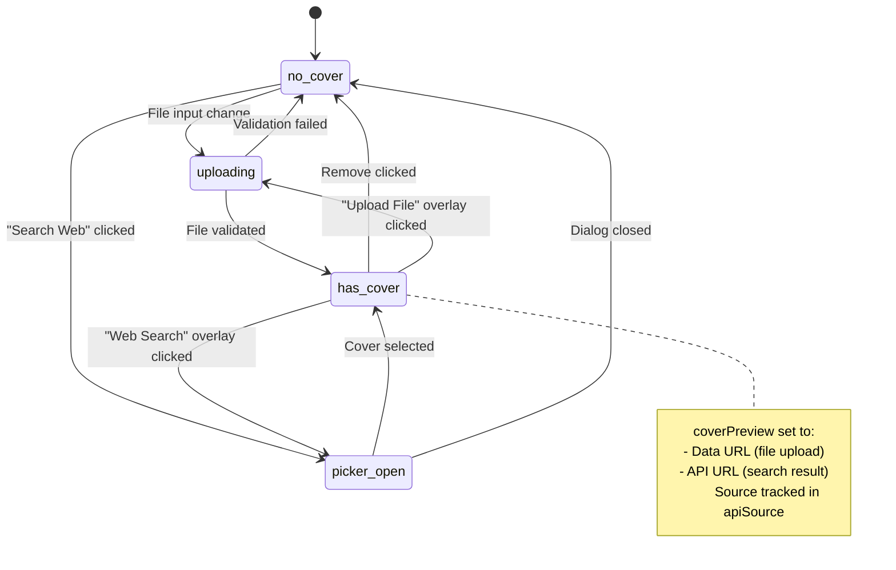
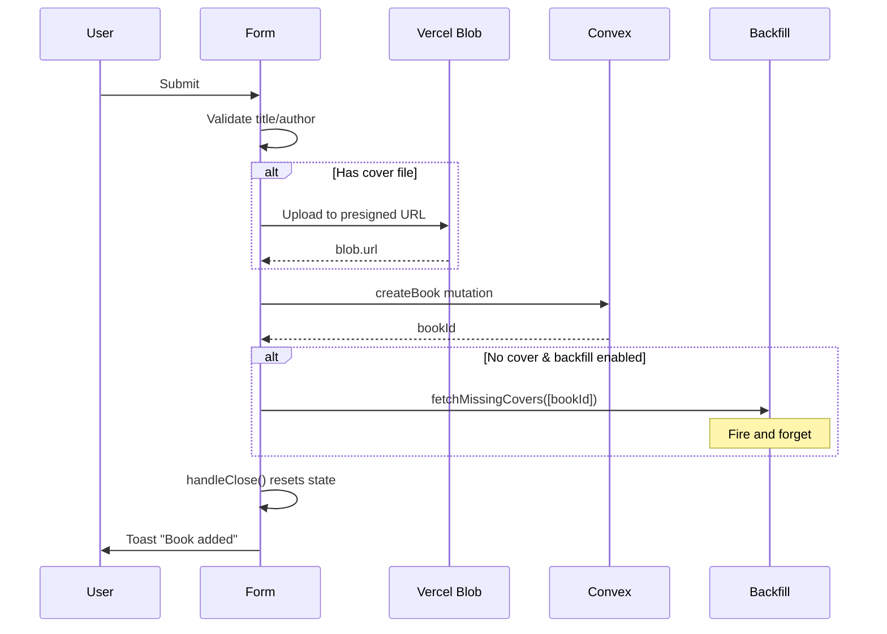

# Add Book Sheet Flow

The AddBookSheet component (`components/book/AddBookSheet.tsx`) manages a multi-step book creation form with search integration.

## State Overview

While not a formal state machine, this component has significant state complexity:

```mermaid
flowchart TD
    subgraph "Form State"
        title[title]
        author[author]
        status[status]
        coverFile[coverFile]
        coverPreview[coverPreview]
        isFavorite[isFavorite]
        isAudiobook[isAudiobook]
        dateFinished[dateFinished]
    end

    subgraph "API Search State"
        apiId[apiId]
        apiSource[apiSource: manual | open-library | google-books]
        isbn[isbn]
        publishedYear[publishedYear]
        pageCount[pageCount]
        apiCoverUrl[apiCoverUrl]
    end

    subgraph "UI State"
        isOpen[isOpen]
        isSubmitting[isSubmitting]
        error[error]
        showCoverPicker[showCoverPicker]
    end
```

## Cover Selection Flow



## Form Submission Flow



## Controlled vs Uncontrolled Mode

The component supports both modes:

```typescript
// Uncontrolled (manages own state)
<AddBookSheet triggerLabel="Add Book" />

// Controlled (parent manages open state)
<AddBookSheet
  isOpen={isModalOpen}
  onOpenChange={setIsModalOpen}
/>
```

## State Reset on Close

`handleClose()` resets all 15+ state variables:

- Form fields (title, author, status, dates, flags)
- Cover state (file, preview, API cover)
- Search result fields (apiId, apiSource, isbn, etc.)
- UI state (error, cover picker)

## Race Condition Prevention

- `isSubmitting` disables all inputs during submission
- Blob upload completes before mutation call
- Cover backfill is fire-and-forget (doesn't block close)
