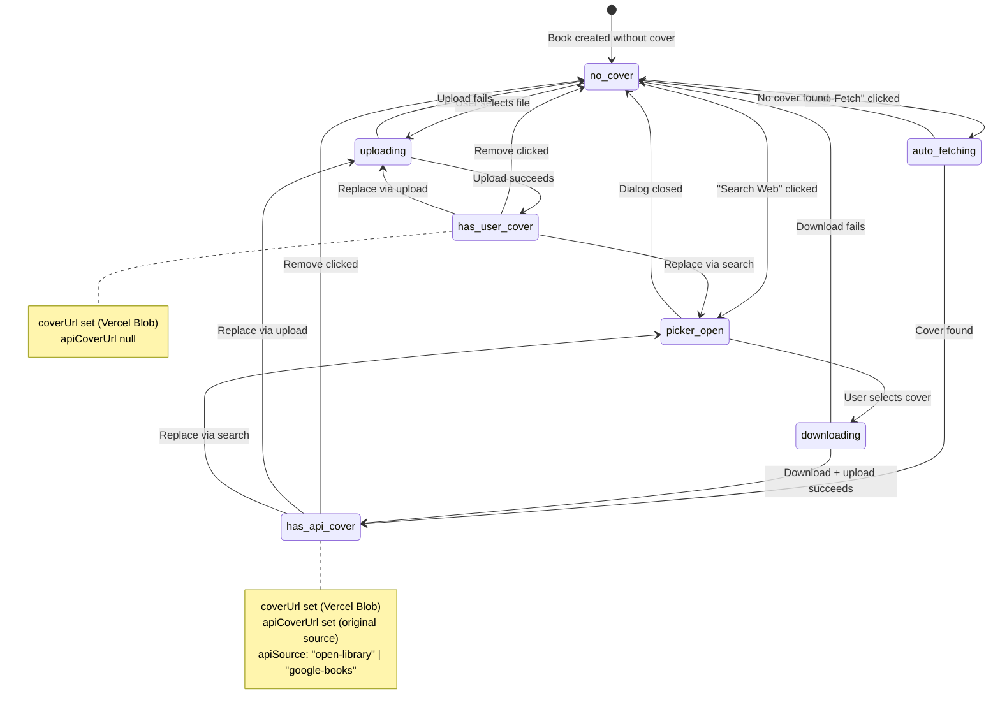
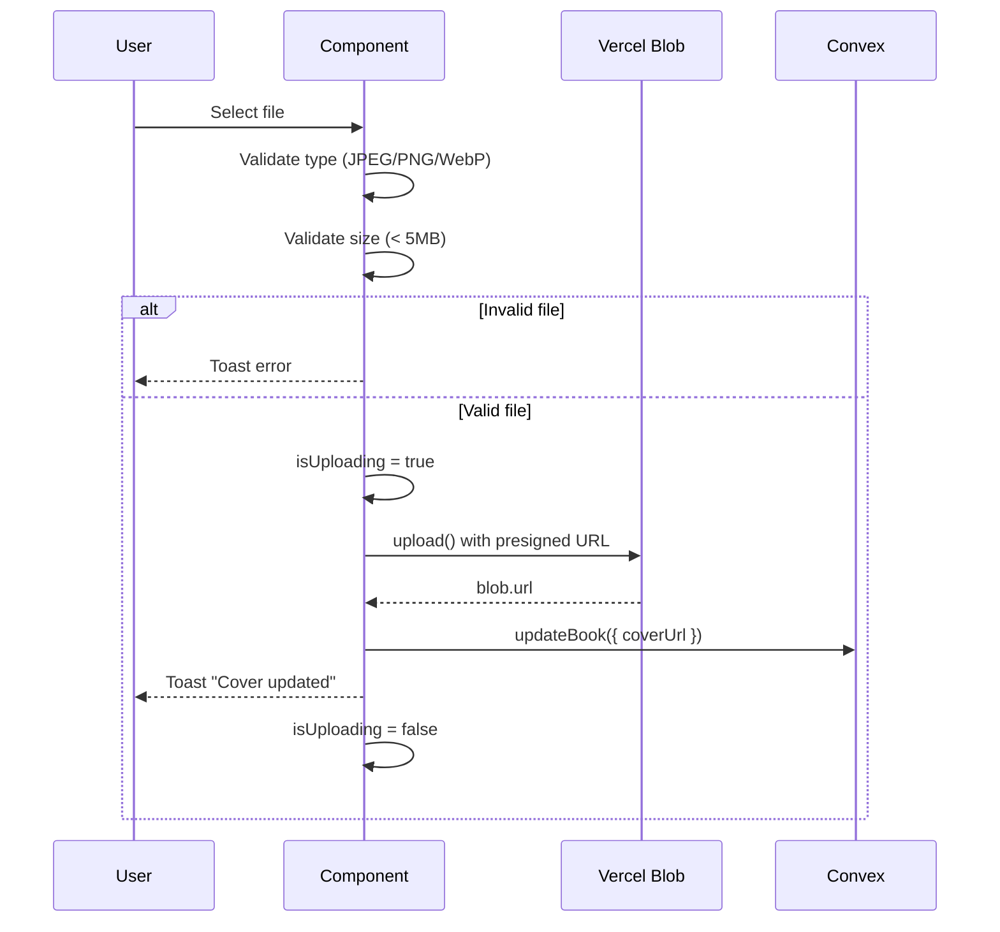
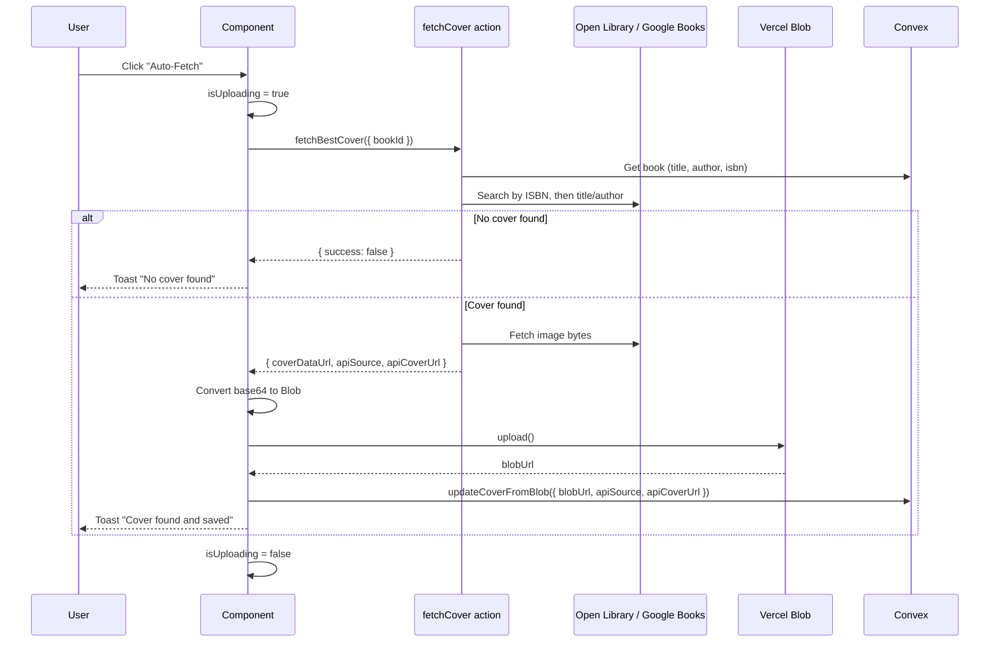
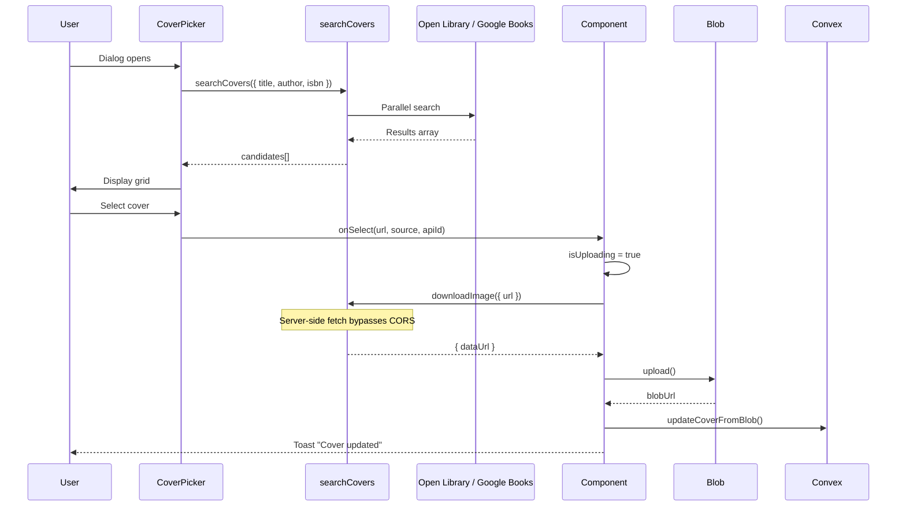

# Book Cover Manager Flow

The BookCoverManager component (`components/book/BookCoverManager.tsx`) handles multiple cover source types with upload, search, auto-fetch, and removal operations.

## Cover Source State



## Operation Flows

### Manual Upload



### Auto-Fetch ("I'm Feeling Lucky")



### Web Search + Select



## Cover Storage Model

The book record stores both user uploads and API covers:

```typescript
type Book = {
  coverUrl?: string; // User uploaded (Vercel Blob URL)
  apiCoverUrl?: string; // Original API URL (for attribution)
  apiSource?: "open-library" | "google-books" | "manual";
  apiId?: string; // Source-specific ID
};
```

Display priority: `coverUrl ?? apiCoverUrl`

## Error Handling

| Error             | User Feedback                           | Recovery                      |
| ----------------- | --------------------------------------- | ----------------------------- |
| Invalid file type | Toast: "Please upload JPG/PNG/WebP"     | Select different file         |
| File too large    | Toast: "Images must be < 5MB"           | Compress and retry            |
| Upload failed     | Toast: "Upload failed. Try again."      | Retry                         |
| No cover found    | Toast: "No cover found"                 | Try manual search             |
| Auto-fetch failed | Toast: "Try searching manually"         | Use CoverPicker               |
| Download failed   | Toast: "Could not download from source" | Try different cover or upload |

## UI States

```mermaid
flowchart TD
    A{activeCover exists?}
    A -->|Yes| B[Show cover image]
    A -->|No| C[Show placeholder with title/author]

    B --> D{isHovered or isUploading?}
    D -->|Yes| E[Show overlay]
    E --> F{isUploading?}
    F -->|Yes| G[Show spinner + "Updating..."]
    F -->|No| H[Show action buttons]
    H --> I[Search Web]
    H --> J[Upload File]
    H --> K[Remove]

    C --> L{isUploading?}
    L -->|Yes| M[Show spinner in dashed box]
    L -->|No| N[Show action buttons]
    N --> O[Auto-Fetch]
    N --> P[Search Web]
    N --> Q[Upload File]
```

## Local State

```typescript
const [isHovered, setIsHovered] = useState(false); // Overlay visibility
const [isUploading, setIsUploading] = useState(false); // Loading state for all operations
const [showPicker, setShowPicker] = useState(false); // CoverPicker dialog
const fileInputRef = useRef<HTMLInputElement>(null); // Hidden file input
```

Only one piece of async state (`isUploading`) guards all operations, preventing race conditions from concurrent uploads/fetches.
