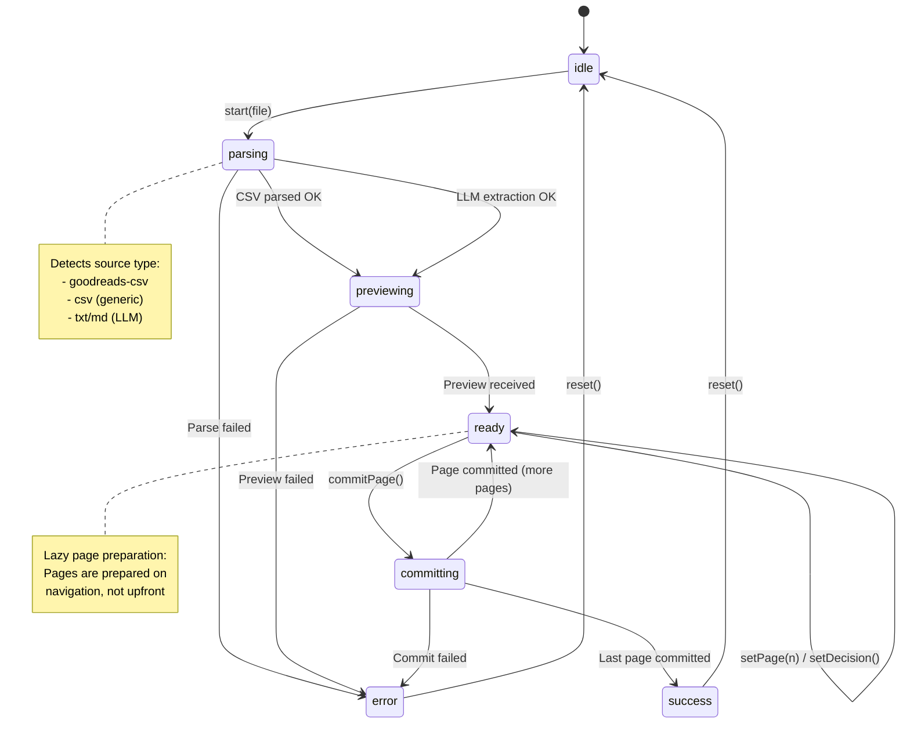

# Import Flow State Machine

The import flow (`hooks/useImportJob.ts`, `components/import/ImportFlow.tsx`) is the most complex state machine in the application. It handles file parsing, preview generation, deduplication, and batch commits.

## State Machine



## State Definition

```typescript
type Status = "idle" | "parsing" | "previewing" | "ready" | "committing" | "success" | "error";

type State = {
  status: Status;
  fileName?: string;
  sourceType?: "goodreads-csv" | "csv" | "txt" | "md" | "unknown";
  importRunId?: string;
  page: number;
  totalPages: number;
  pages: ParsedBook[][];
  preparedPages: boolean[]; // Tracks which pages have dedup info
  dedupMatches: DedupMatch[];
  warnings: string[];
  errors: string[];
  decisions: Record<string, Decision>;
  summary: { created: number; merged: number; skipped: number };
};
```

## Actions

| Action            | Transition                  | Side Effects                                        |
| ----------------- | --------------------------- | --------------------------------------------------- |
| `start(file)`     | idle -> parsing             | Clears all state, starts file processing            |
| `PREVIEW_SUCCESS` | previewing -> ready         | Stores pages, dedup matches, initializes pagination |
| `PREVIEW_ERROR`   | parsing/previewing -> error | Records error message                               |
| `SET_PAGE`        | ready -> ready              | Changes current page, triggers lazy preparation     |
| `SET_DECISION`    | ready -> ready              | Stores user's merge/skip/create choice              |
| `commitPage()`    | ready -> committing         | Submits page decisions to backend                   |
| `COMMIT_SUCCESS`  | committing -> ready/success | Updates summary, advances page or completes         |
| `COMMIT_ERROR`    | committing -> error         | Records error message                               |
| `reset()`         | any -> idle                 | Clears all state                                    |

## Race Condition Handling

The hook uses `preparePageInFlight` ref to prevent duplicate preparation requests:

```typescript
const preparePageInFlight = useRef(new Map<number, Promise<PreviewResult | null>>());
```

When navigating pages, `ensurePagePrepared()` checks:

1. Is page already prepared? (skip)
2. Is preparation in flight? (return existing promise)
3. Otherwise, start new preparation

## Error States

| Error Source             | Recovery Path                |
| ------------------------ | ---------------------------- |
| File parse failure       | Reset and try different file |
| LLM extraction failure   | Reset, try simpler format    |
| Preview mutation failure | Reset, retry                 |
| Commit mutation failure  | Stays in error, can reset    |

## Integration Points

- **ExtractionProgress**: Renders during parsing/previewing/committing
- **PreviewTable**: Renders during ready state
- **CommitSummary**: Renders during success state
- **UploadDropzone**: Active during idle and ready states
