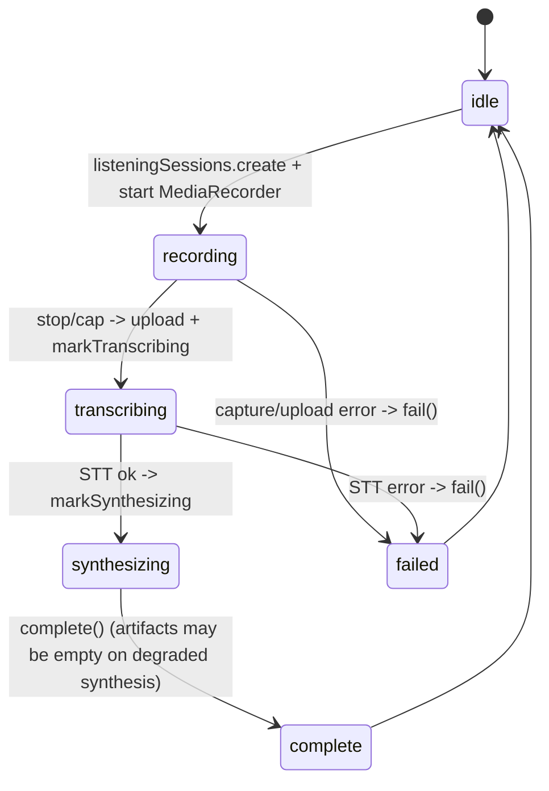
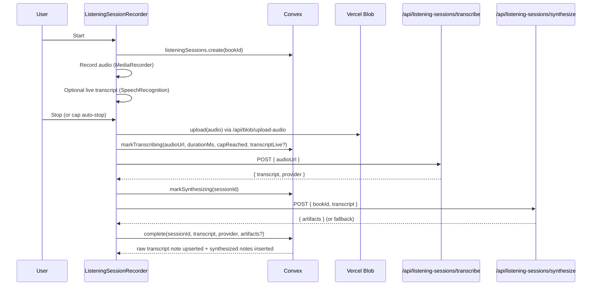

# Listening Sessions Flow (Voice Notes + Synthesis)

Voice-first note capture for readers who want to keep reading while talking through reactions, ideas, and questions.

## Goals

- One-tap recording from book detail.
- Clear active-recording UI.
- Long-session support (30+ min) with cap warning + forced rollover.
- Always save raw transcript.
- Generate useful artifacts in book context.

## Current MVP Implementation

### End-to-End Pipeline

1. **Record**
   - UI + orchestration: `components/notes/ListeningSessionRecorder.tsx` + `components/notes/useListeningSessionRecorder.ts`
   - Capture: `MediaRecorder` chunks to memory (1s slices).
   - Optional live transcript: best-effort browser `SpeechRecognition` / `webkitSpeechRecognition`.

2. **Upload audio**
   - Client: `@vercel/blob/client` `upload()` with `handleUploadUrl=/api/blob/upload-audio`
   - Server: `app/api/blob/upload-audio/route.ts` uses `handleUpload()` to mint an upload token.
   - Gotcha: audio codec content-types are normalized and explicitly allowed.

3. **Transcribe (batch STT)**
   - Route: `app/api/listening-sessions/transcribe/route.ts`
   - Audio bytes are fetched from the blob URL, then sent to:
     - Deepgram (preferred if `DEEPGRAM_API_KEY` is set; `DEEPGRAM_STT_MODEL` default `nova-3`)
     - ElevenLabs (fallback if `ELEVENLABS_API_KEY` is set; `ELEVENLABS_STT_MODEL` default `scribe_v2`)

4. **Synthesize (LLM)**
   - Route: `app/api/listening-sessions/synthesize/route.ts`
   - Provider: OpenRouter (`OPENROUTER_API_KEY`)
   - Request: `{ bookId, transcript }` (context is fetched server-side from Convex)
   - Output: strict JSON schema via `response_format=json_schema`
   - Prompt template: `lib/listening-sessions/synthesisPrompt.ts`
   - Model + knobs: `lib/listening-sessions/synthesisConfig.ts` (env-driven)

5. **Persist**
   - Convex: `convex/listeningSessions.ts`
   - Always writes/updates a **raw transcript note**.
   - Writes **one synthesized note** plus **quote notes** (note types are `note` or `quote`).

## Server Session Status

## Processing Sequence

## Future (Not Shipped)

- Durable server-side orchestration + retries (tab close shouldn’t strand sessions).
- Private audio blobs (avoid “public URL = access”).
- Review/publish workflow (choose which artifacts become canonical notes).
