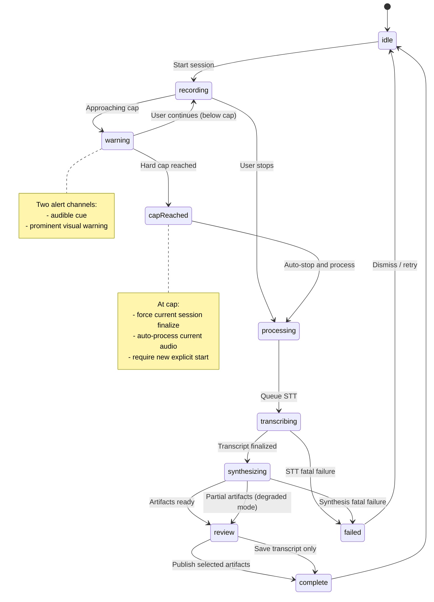
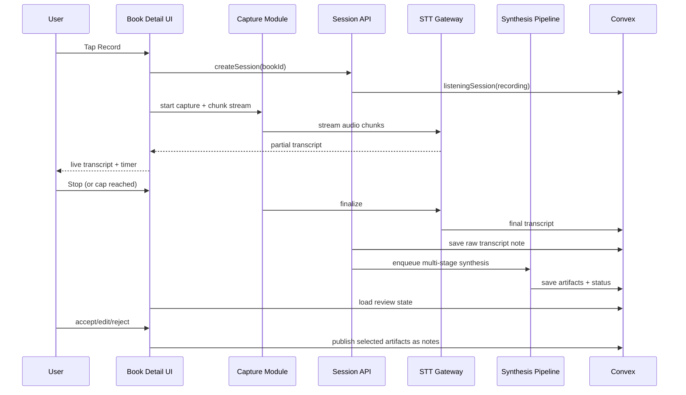

# Listening Sessions Flow (Voice Notes + Synthesis)

Voice-first note capture for readers who want to keep reading while talking through reactions, ideas, and questions.

## Goals

- One-tap recording from book detail.
- Clear active-recording UI.
- Optional live transcript feedback (browser-dependent).
- Long-session support (30+ min).
- Safe cap handling with audible + visual warning and forced rollover.
- Always save raw transcript.
- Generate useful artifacts in book context.

## Current MVP Implementation (2026-02-16)

This is what actually ships today (not the aspirational design below).

### End-to-End Pipeline

1. **Record**
   - UI: `components/notes/ListeningSessionRecorder.tsx`
   - Capture: `MediaRecorder` chunks to memory (1s slices).
   - Live transcript: best-effort `SpeechRecognition` / `webkitSpeechRecognition` (not guaranteed).

2. **Upload audio**
   - Client: `@vercel/blob/client` `upload()` with `handleUploadUrl=/api/blob/upload-audio`
   - Server: `app/api/blob/upload-audio/route.ts` uses `handleUpload()` to mint a client token.
   - Gotcha: codec content-types (for example `audio/webm;codecs=opus`) must be normalized/allowed.

3. **Transcribe (batch)**
   - Route: `app/api/listening-sessions/transcribe/route.ts`
   - Audio bytes are fetched from the blob URL, then sent to:
     - Deepgram (preferred if `DEEPGRAM_API_KEY` is set)
       - Model: `DEEPGRAM_STT_MODEL` (default `nova-3`)
     - ElevenLabs (fallback if `ELEVENLABS_API_KEY` is set)
       - Model: `ELEVENLABS_STT_MODEL` (default `scribe_v2`)

4. **Synthesize (LLM)**
   - Route: `app/api/listening-sessions/synthesize/route.ts`
   - Provider: OpenRouter (`OPENROUTER_API_KEY`)
   - Output: strict JSON schema via `response_format=json_schema`
   - Model + knobs:
     - Model: `OPENROUTER_LISTENING_MODEL` (default `google/gemini-3-pro-preview`)
     - Fallback models: `OPENROUTER_LISTENING_FALLBACK_MODELS` (CSV; defaults are model-dependent)
     - Temperature: `OPENROUTER_LISTENING_TEMPERATURE` (default `0.35`, omitted by default for OpenAI GPT-5 models)
     - Max output tokens: `OPENROUTER_LISTENING_MAX_TOKENS` (default `4096`)
     - Optional: `OPENROUTER_LISTENING_TOP_P`, `OPENROUTER_LISTENING_SEED`
     - Optional: `OPENROUTER_LISTENING_REASONING_EFFORT` (`low|medium|high`, reasoning excluded from response)
   - Prompt template: `lib/listening-sessions/synthesisPrompt.ts`
   - Reliability hardening:
     - `provider.require_parameters=true` so OpenRouter won't route to providers that ignore structured outputs.
     - `response-healing` plugin enabled (best-effort JSON repair).
     - Model fallbacks enabled via OpenRouter `models` parameter.

5. **Persist**
   - Convex: `convex/listeningSessions.ts`
   - Always writes/updates a **raw transcript note**.
   - Writes **one synthesized note** plus **quote notes** (note types are `note` or `quote`).

## State Machine

## Processing Sequence

## Module Boundaries

1. `ListeningSessionOrchestrator`
   - Owns state transitions and idempotency.
   - Hides provider and transport details.
2. `AudioCaptureAdapter`
   - Browser recording/chunking/retry/recovery.
   - Emits typed capture errors (no silent drops).
3. `STTGateway`
   - Unified start/stream/finalize contract.
   - Provider routing + fallback policy.
4. `TranscriptStore`
   - Persist partial/final transcript.
   - Always writes raw transcript note.
5. `SynthesisPipeline`
   - Multi-stage LLM calls with per-stage schema validation.
   - Partial-success semantics by design.
6. `ArtifactReviewPublisher`
   - User approval/edit/reject.
   - Publish accepted artifacts to canonical notes.

## Proposed Artifacts

- `insights[]`
- `openQuestions[]`
- `quotes[]`
- `followUpQuestions[]`
- `contextExpansions[]` (historical/literary/contextual)

Each artifact keeps provenance:

- `sessionId`
- `stage`
- `promptVersion`
- `model`
- `createdAt`

## Context Pack Inputs (for Synthesis)

- Current book metadata.
- Current transcript.
- User books by status:
  - currently reading
  - want to read
  - read
- Prior notes from this book.
- Selected cross-book notes.

Selection must be token-budgeted and deterministic (rank by recency + relevance + diversity).

## Provider Notes (2026-02-16)

- ElevenLabs supports batch and realtime STT for `scribe_v2` / `scribe_v2_realtime`; docs include signed URL pattern and single-use token support.
- Deepgram streaming endpoint is `wss://api.deepgram.com/v1/listen` with `model=nova-3`, interim results, and explicit finalize semantics.
- AssemblyAI Universal-Streaming docs expose temporary auth and WebSocket streaming with session options (including max duration controls); public docs note up to 3-hour session length.

Treat these as integration assumptions that must be re-validated before implementation.

## Backlog Mapping

- #105 Epic
- #144 STT benchmark + provider decision matrix
- #145 Convex data model + state machine
- #146 Recording UX
- #147 Resilient audio capture + chunk upload
- #148 Cap warning + forced rollover
- #149 STT gateway + adapter fallback
- #150 Transcript persistence + raw transcript note
- #151 Multi-stage synthesis
- #152 Context packer
- #153 Review and publish workflow
- #154 Observability + cost guardrails
- #155 Reliability tests

## Vox Patterns Reused

- Streaming-first session orchestration with bounded finalize timeout.
- Fallback to non-streaming path when setup/finalize fails.
- Capture integrity checks before STT.
- Provider error normalization and fallback eligibility.
