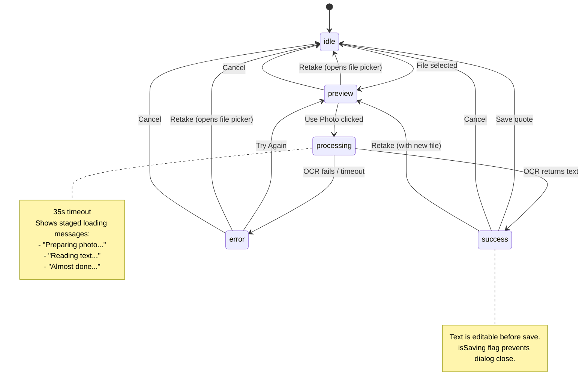
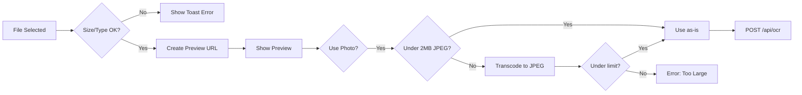

# Photo Quote Capture State Machine

The PhotoQuoteCapture component (`components/notes/PhotoQuoteCapture.tsx`) handles camera-based OCR for extracting quotes from book pages.

## State Machine



## State Definition

```typescript
type CaptureState =
  | { step: "idle" }
  | { step: "preview"; previewUrl: string }
  | { step: "processing"; previewUrl: string }
  | { step: "success"; text: string; previewUrl: string }
  | { step: "error"; message: string; previewUrl?: string };
```

## Non-Linear Transitions

1. **Retake from any state**: User can always choose to take a new photo
2. **Try Again from error**: Returns to preview to retry OCR without new photo
3. **Edit in success**: Text is mutable before final save

## Error Handling

| Error Type    | Message                                 | Recovery                  |
| ------------- | --------------------------------------- | ------------------------- |
| Timeout (35s) | "Taking too long. Please try again."    | Try Again or Retake       |
| OCR failure   | Server error message                    | Try Again or Retake       |
| No text found | "No text found in image."               | Retake with clearer photo |
| Network error | "Network error. Check your connection." | Try Again                 |

## Image Processing Pipeline



## Side Effect Management

- `selectedFileRef`: Preserves File object across renders
- `previewUrlRef`: Manages object URL lifecycle (revoke on cleanup)
- `isSaving`: Prevents dialog close during mutation
- Loading messages: Timer-based progression during processing
