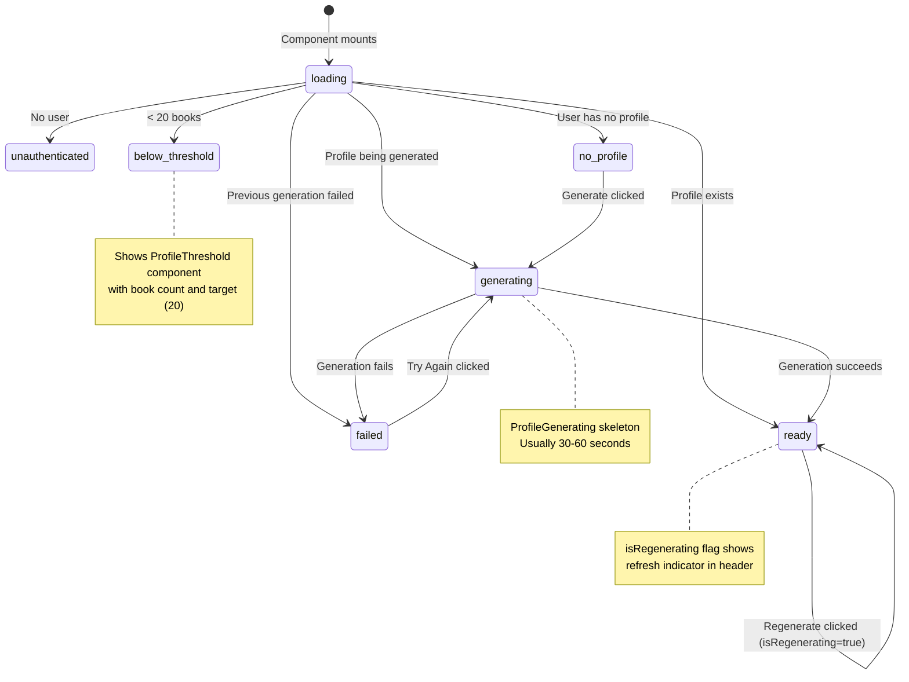
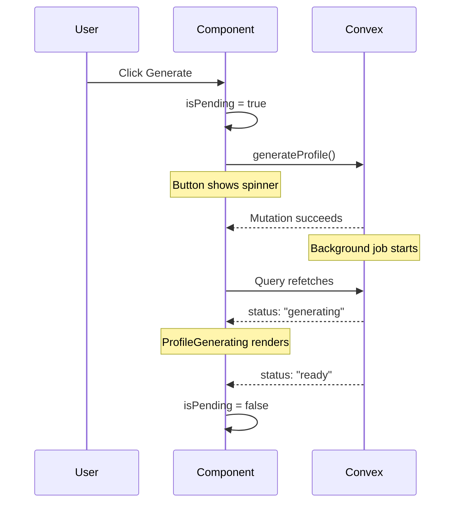

# Profile Generation State Machine

The ProfilePage component (`components/profile/ProfilePage.tsx`) manages AI-powered profile generation with multiple states.

Current profile threshold in code is `20` books (`convex/profiles.ts`), not 5.

## State Machine



## Input Signals (Current vs Next)

Current generation context includes:

- read books
- currently-reading books
- want-to-read books
- favorites, audiobook flags, rereads, recent completion timing

Next planned context expansion:

- voice-note synthesis artifacts (see #168)

## Query Response Shape

```typescript
type ProfileQueryResult =
  | { status: "unauthenticated" }
  | { status: "below_threshold"; bookCount: number; booksNeeded: number }
  | { status: "no_profile"; bookCount: number; stats: ProfileStats }
  | { status: "generating"; bookCount: number; profile?: ProfilePreview }
  | { status: "failed"; bookCount: number; error: string; profile: ProfilePreview }
  | {
      status: "ready";
      profile: Profile;
      isStale: boolean;
      isRegenerating: boolean;
      bookCount: number;
    };
```

## Optimistic State

The component uses `isPending` for immediate feedback:



## Regeneration Flow

When regenerating an existing profile:

1. `handleRegenerate()` sets `isPending = true`
2. Calls `generateProfile()` mutation
3. Query updates with `isRegenerating: true`
4. Component shows refresh indicator in header
5. When complete, `isRegenerating` becomes false
6. Effect clears `isPending`

## Error Recovery

| State                       | Recovery Action                                 |
| --------------------------- | ----------------------------------------------- |
| `failed`                    | "Try Again" button -> calls `generateProfile()` |
| Network error in generation | Toast shown, `isPending` reset                  |
| Below threshold             | User must add more books (20 total required)    |
