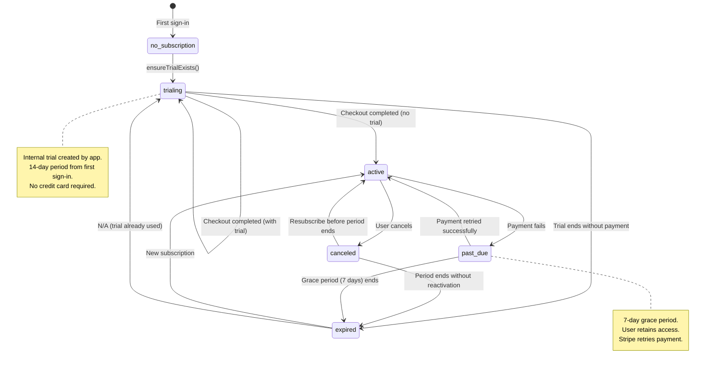
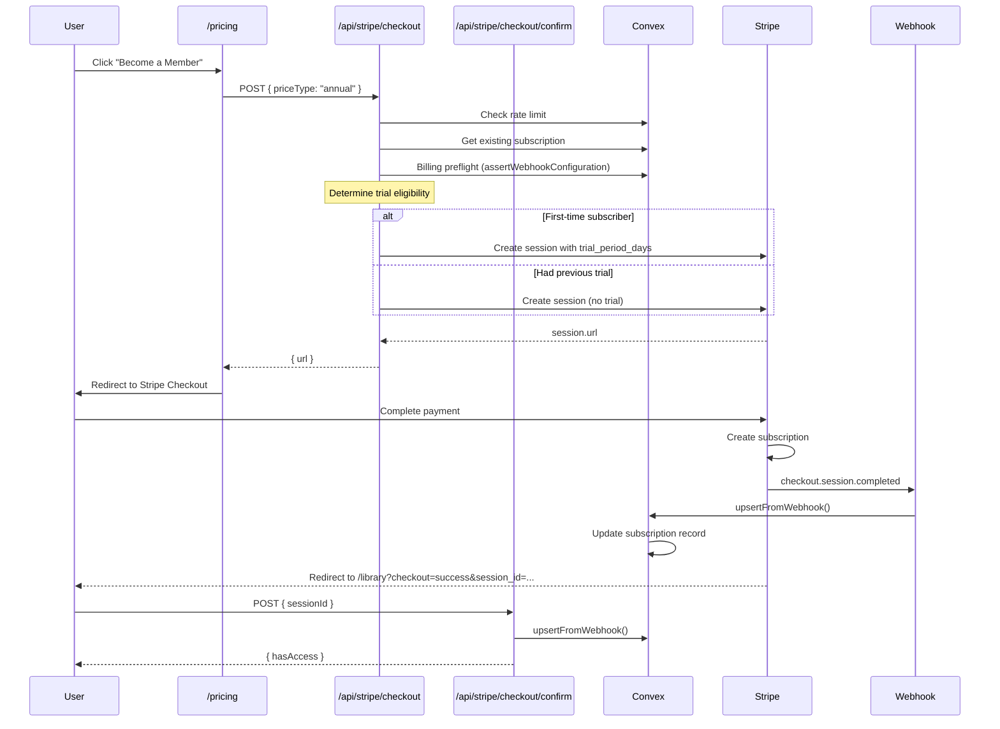
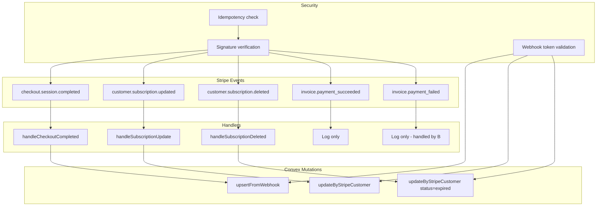

# Stripe Subscription Flow

The subscription system (`convex/subscriptions.ts`, `app/api/stripe/*`, `lib/hooks/useSubscriptionState.ts`) handles the full lifecycle of paid subscriptions including trials, payments, cancellations, and expiration.

## Subscription State Machine



## Access Control Logic

```typescript
function hasAccess(subscription: Subscription | null): boolean {
  if (!subscription) return false;

  switch (subscription.status) {
    case "trialing":
      return subscription.trialEndsAt >= Date.now();
    case "active":
      return true;
    case "canceled":
      return subscription.currentPeriodEnd >= Date.now();
    case "past_due":
      // 7-day grace period from last update
      const gracePeriodEnd = subscription.updatedAt + 7 * 24 * 60 * 60 * 1000;
      return Date.now() < gracePeriodEnd && subscription.currentPeriodEnd >= Date.now();
    case "expired":
      return false;
  }
}
```

## Checkout Flow



## Webhook Event Flow



## Client State Hook

The `useSubscriptionState()` hook provides a discriminated union for UI rendering:

```typescript
type SubscriptionState =
  | { state: "loading" }
  | { state: "unauthenticated" }
  | { state: "trialing"; daysRemaining: number; isUrgent: boolean }
  | { state: "trial_expired" }
  | { state: "active" }
  | { state: "canceled"; daysRemaining: number };
```

## State Transitions by Event

| Event                             | From State      | To State | Side Effects                   |
| --------------------------------- | --------------- | -------- | ------------------------------ |
| `ensureTrialExists()` mutation    | no_subscription | trialing | Creates internal trial         |
| `checkout.session.completed`      | trialing        | active   | Links Stripe customer ID       |
| `subscription.updated` (active)   | any             | active   | Updates period end             |
| `subscription.updated` (canceled) | active          | canceled | Sets cancelAtPeriodEnd         |
| `subscription.updated` (past_due) | active          | past_due | Payment failed                 |
| `subscription.deleted`            | any             | expired  | Full access revoked            |
| Trial period ends                 | trialing        | expired  | Detected by query, not webhook |
| Current period ends               | canceled        | expired  | Detected by query, not webhook |

## Race Condition Handling

### Duplicate Subscription Prevention

```typescript
// In ensureTrialExists
const existing = await ctx.db
  .query("subscriptions")
  .withIndex("by_user", (q) => q.eq("userId", userId))
  .first(); // Use .first() not .unique()

if (existing) {
  // Clean up any duplicates from race conditions
  const allMatches = await ctx.db
    .query("subscriptions")
    .withIndex("by_user", (q) => q.eq("userId", userId))
    .collect();

  if (allMatches.length > 1) {
    const sorted = allMatches.sort((a, b) => a._creationTime - b._creationTime);
    for (const dupe of sorted.slice(1)) {
      await ctx.db.delete(dupe._id);
    }
  }
}
```

### Webhook Idempotency

```typescript
// In webhook handler
const isProcessed = await convex.query(api.webhookEvents.isProcessed, {
  eventId: event.id,
});

if (isProcessed) {
  return NextResponse.json({ received: true, skipped: true });
}

// After processing
await convex.mutation(api.webhookEvents.markProcessed, {
  eventId: event.id,
  eventType: event.type,
});
```

## Error Recovery

| Error                     | Recovery Path                                 |
| ------------------------- | --------------------------------------------- |
| Checkout rate limited     | Wait 1 hour, retry                            |
| Webhook signature invalid | Return 400, Stripe won't retry                |
| Webhook processing fails  | Return 500, Stripe retries with backoff       |
| User not found in upsert  | Throw error, triggers Stripe retry            |
| Subscription lookup fails | Log error, return null (graceful degradation) |
