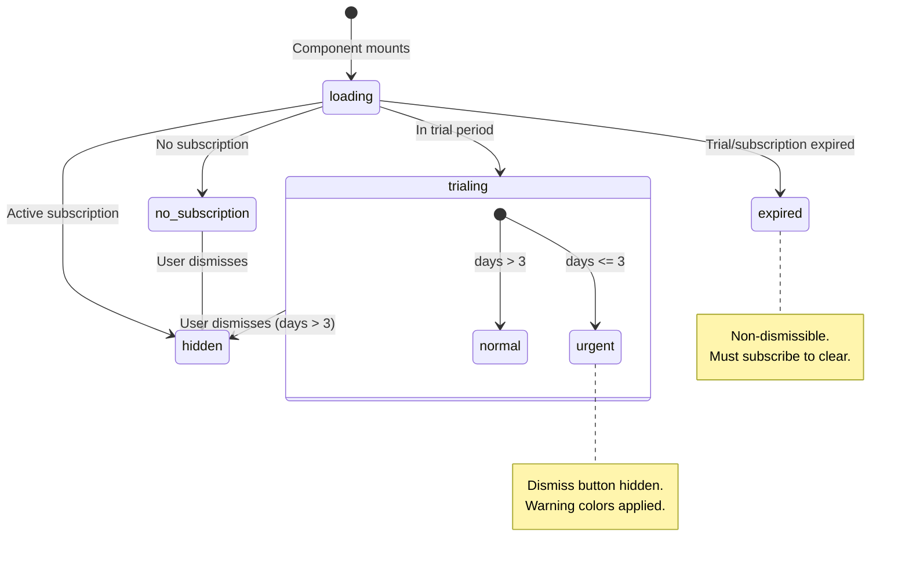
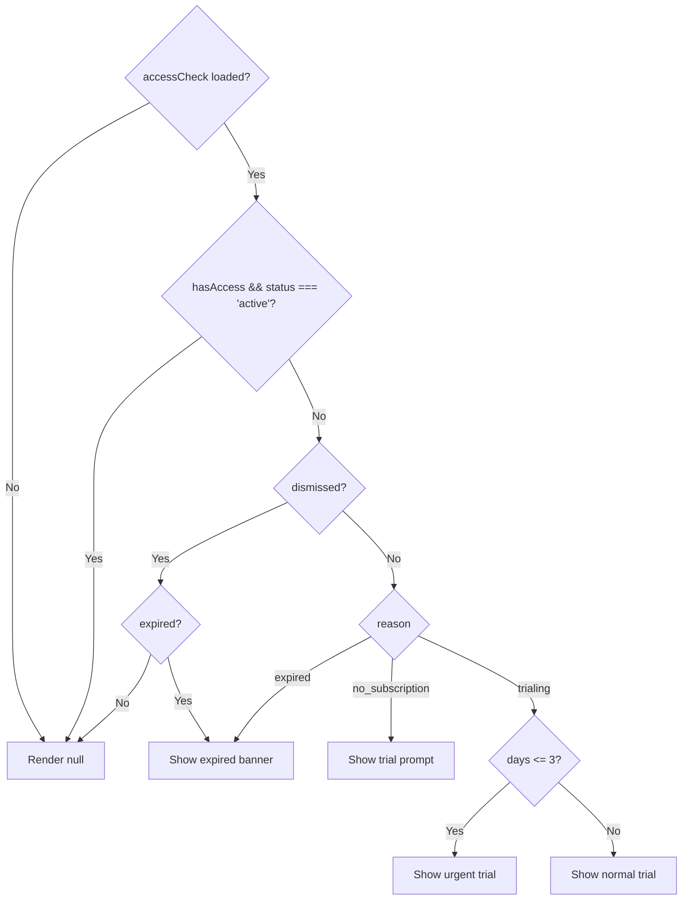

# Subscription Banner State Machine

The TrialBanner component (`components/subscription/TrialBanner.tsx`) displays subscription status with context-aware messaging.

## State Machine



## Query Response Shape

```typescript
type AccessCheck = {
  hasAccess: boolean;
  status: "active" | "trialing" | null;
  daysRemaining?: number;
  reason: "no_subscription" | "trial_expired" | "subscription_expired" | null;
};
```

## Display Logic



## Banner Variants

| State               | Background   | CTA                             | Dismissible |
| ------------------- | ------------ | ------------------------------- | ----------- |
| no_subscription     | surface-dawn | "Start Free Trial"              | Yes         |
| trialing (>3 days)  | surface-dawn | "Subscribe Now"                 | Yes         |
| trialing (<=3 days) | warning/5    | "Subscribe Now" (warning color) | No          |
| expired             | error/5      | "Subscribe Now" (error color)   | No          |

## Local State

Only one piece of local state:

```typescript
const [dismissed, setDismissed] = useState(false);
```

This resets on page navigation (component unmount).

## Expiration Non-Dismissibility

The expired state is intentionally non-dismissible to ensure users see the subscription prompt. The banner persists until:

1. User subscribes (status changes)
2. Page navigation (component remounts)
