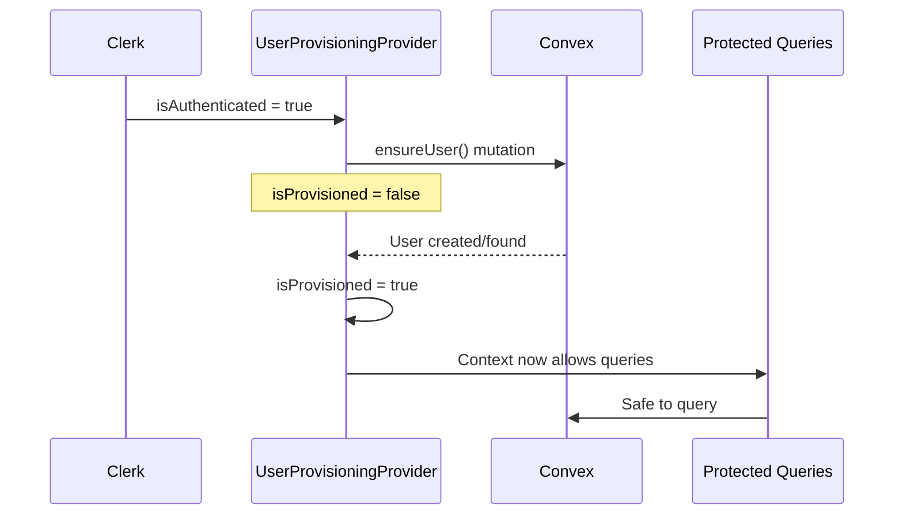
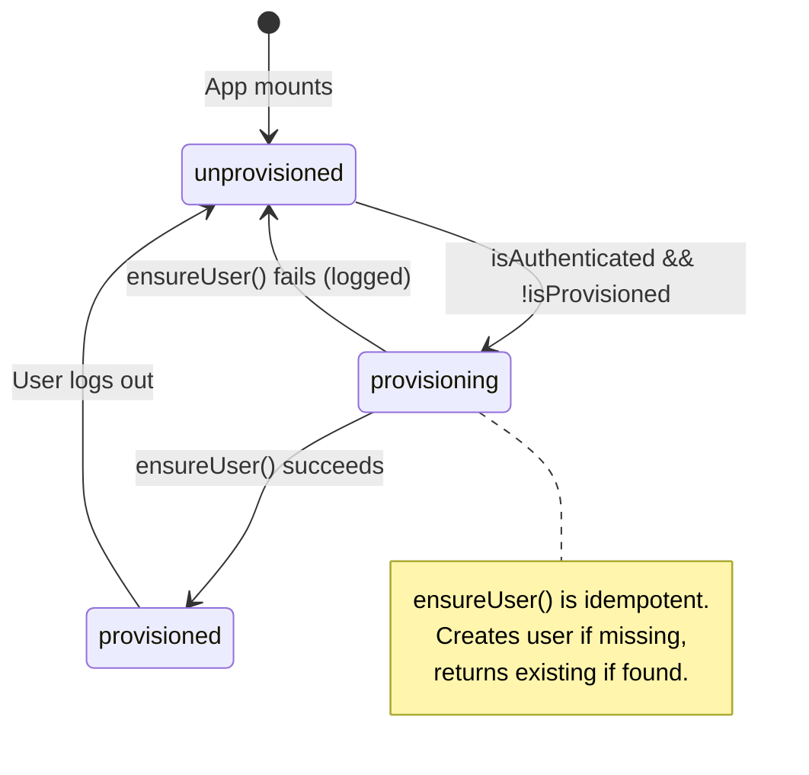

# User Provisioning Flow

The ConvexClientProvider (`app/ConvexClientProvider.tsx`) handles the critical first-login race condition where Convex queries might run before the user record exists.

## Problem Statement

When a user signs in for the first time:

1. Clerk authenticates the user
2. Convex receives JWT with userId
3. Queries run with that userId
4. BUT: User record doesn't exist yet in Convex

This causes "User not found" errors on first login.

## Solution: Provisioning Context



## State Machine



## Integration with useAuthedQuery

```typescript
// In useAuthedQuery hook (not shown in audit)
const { isProvisioned } = useUserProvisioning();

// Queries skip execution until provisioned
if (!isProvisioned) {
  return undefined; // Loading state
}
```

## State Definition

```typescript
const UserProvisioningContext = createContext<{ isProvisioned: boolean }>({
  isProvisioned: false,
});
```

## Edge Cases

| Scenario               | Behavior                              |
| ---------------------- | ------------------------------------- |
| Cold start, signed in  | Provisions on mount                   |
| Sign in during session | Provisions on auth change             |
| Sign out               | Resets `isProvisioned = false`        |
| ensureUser fails       | Logs error, stays unprovisioned       |
| Rapid auth changes     | Effect cleanup prevents stale updates |

## Why Not Webhook-Only?

While Clerk webhooks create users, there's still a race:

1. User signs in
2. Webhook fires (async)
3. Client makes query
4. Query might arrive before webhook completes

The `ensureUser()` approach guarantees the user exists before any queries run.
